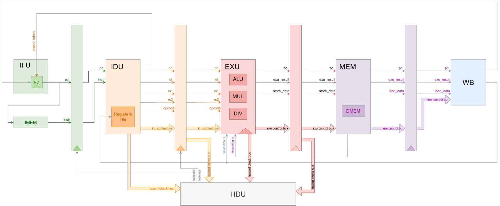

# RV32IM

Ядро RISC-V **RV32IM** (32-bit, Integer, Multiply).

## Архитектура

| | |
| ------------- | ------------------------------------------------------------------------ |
| **IFU** | PC; выбор next-PC: PC+4 / branch / JAL / JALR; IMEM                 |
| **IDU** | Reg File; здесь вычисляется branch_taken, branch_dest    |
| **EXU** | ALU, MUL, DIV; forwarding операндов из MEM/WB                 |
| **MEM** | Load/store в DMEM (byte/half/word по funct3)                          |
| **WB**  | Mux результата (ALU / load / PC+4) -> запись в Reg File |


Полная документация в `docs/`
`riscv_top`: ядро, IMEM, DMEM.
Конфиг в `src/includes/riscv_pkg.sv`. Во всех прочих файлах используется namespace.

### Переходы (branch / jump)

Решение о прыжке принимается на **IDU**, не на EXU:

- `branch_taken`, `pc_target`, `pc_target_jalr`, `opcode` идут из IDU в IFU;
- предсказание: всегда **PC+4**; при taken - `flush` стены IFU->IDU, сброс ошибочно выбранной инструкции.

### Hazard

**HDU** (`riscv_hazard_hdu`) управляет stall/flush:

- **load-use** - stall IFU/IDU, bubble в EXU;
- **branch/JALR RAW** (нужный регистр еще в EXU/MEM) - stall, пока данные не дойдут;
- **mul/div busy** - stall PC/IDU, stall стены IDU->EXU;
- **taken branch** - flush IFU->IDU (если нет stall).

**Forwarding / bypass:**

- MEM->EXU и WB->EXU (`riscv_exu_fwd`);
- WB->IDU - bypass в `Reg File` (для чтения на decode).

WAR/WAW в этом in-order конвейере отдельно не обрабатываются: запись в `Reg File` только на WB, в порядке инструкций.

### M-extension

Умножение и деление - многотактовые блоки в EXU. Пока блок занят, `stall_m_exu` гасит `reg_write`/`mem_write` на выходе EXU и сообщает HDU о busy.

## Структура ядра

```
src/core/
  fetch/      riscv_ifu, riscv_ifu_pc
  decode/     riscv_idu, riscv_idu_{reg_file,imm,cmp,ctrl,dec}
  execute/    riscv_exu, riscv_exu_{ialu,imul,idiv,fwd}
  memory/     riscv_mem
  writeback/  riscv_wb
  hazard/     riscv_hazard_hdu
  walls/      reg_ifu2idu, reg_idu2exu, reg_exu2mem, reg_mem2wb
  primitives/ adder
  riscv_core.sv   # стадии, стены, HDU
```

Подробная документация по модулям: `make html` -> `docs/build/html/`.

## Запуск

```bash
cd ~/RV32IM
make test-dhrystone LOG=0
make test-coremark LOG=0
```

Бенчмарки: официальный Dhrystone 2.1 (`tests/dhrystone`) и EEMBC CoreMark (`tests/coremark`), bare-metal порт в `tests/crt0.s` и `tests/port.c`.

- `LOG=0` - только старт/конец на консоли
- `LOG=1` - лог-файл с меткой времени
- `LOG=2` - лог и трассировка на консоль

```bash
make wave   # gtkwave riscv_sim.vcd
```

## Производительность

RTL-симуляция (циклы до маркера `0x600DC0DE` в DMEM, `make test-* LOG=0`).

Подробности: [docs/...](docs/)

| Тест      | Параметры             | Тактов |
| ------------- | ------------------------------ | -----------: |
| Dhrystone 2.1 | 5 runs (`DHRY_RUNS=5`)       |         7306 |
| CoreMark      | 1 iteration (`ITERATIONS=1`) |       557084 |
